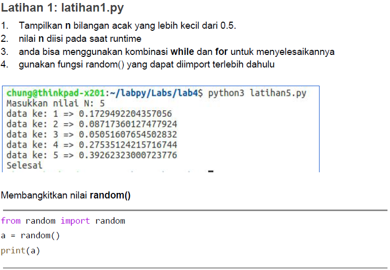
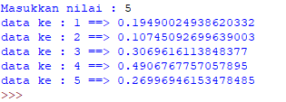
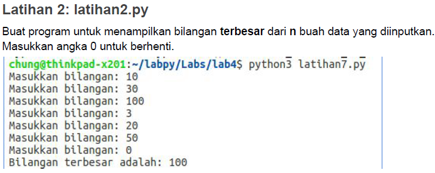
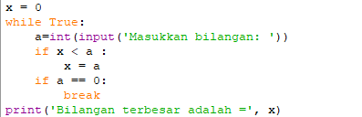
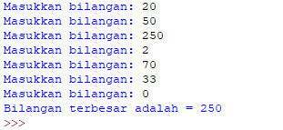
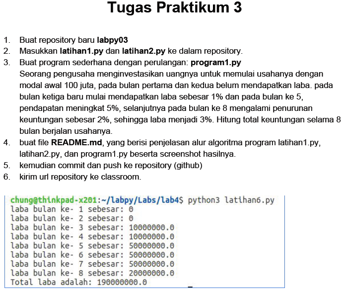
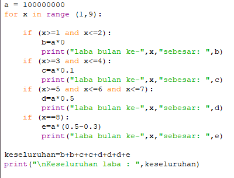
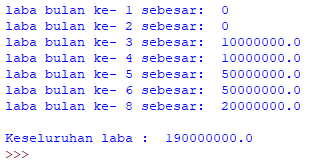

	BAHASA PEMROGRAMAN

	MODUL PRAKTIKUM 3 PERULANGAN

	Dosen : Agung Nugroho, M.Kom

 
	<b>Tugas untuk memenuhi syarat penilain pada Pert-7</b>

	

                 Nama : Jose Fisto

                 NIM : 312010119

                 Kelas : TI.20 A.1

	

	<b>UNIVERSITAS PELITA BANGSA</b>

	<b>FAKULTAS TEKNIK</b>

	<b>TEKNIK INFORMATIKA</b>

	<b>TA 2020 / 2021</b>

# Modul Praktikum 3 Perulangan

## Latihan 1: latihan1.py

Keterangan syntax di atas dapat di uraikan, yaitu :

Dapat dinyatakan bahwa :

- `from random import random` merupakan data yang akan memberikan hasil acak
- `a = int(input("Masukkan nilai : "))` merupakan data integer untuk menentukan berapa data nilai yang akan di hasilkan
- `b = 0` merupakan data integer
- `for i in range(a):` merupakan perulangan dari data input a ke variable i
- `i = random()` variable i merupakan data a yang hasilnya akan memberikan data acak dengan hasil float
- `b+=1` variable b apabila b = 0 maka di tambahkan 1 dengan sebanyak yang di tentukan pada variable a
- `print('data ke :',b,'==>', i)` menunjukkan hasil output pada layar

Maka Output atau hasil tertampil di layar :

## Latihan 2: latihan2.py

Keterangan syntax di atas dapat di uraikan, yaitu :

Dapat dinyatakan bahwa :

- `x = 0` merupakan data integer
- `while True:` menyampaikan kondisi perulangan hingga berhenti
- `a=int(input('Masukkan bilangan: '))` a merupakan data integer ditentukan berapa angka yang keluar
- `if x < a :` `x = a` menyatakan kondisi `if` jika x lebih kecil dari a maka nilai x adalah a
- `if a == 0:` `break` kondisi `if` jika hasil variable a adalah 0 maka berhenti menghitung
- `print('Bilangan terbesar adalah =', x)` mencetak hasil x menampilkan hasil data terbesar dari variable a

Maka Output atau hasil tertampil di layar :

## Tugas Praktikum 3

Keterangan syntax di atas dapat di uraikan, yaitu :

Dapat dinyatakan bahwa :

- `a = 100000000` merupakan modal awal
- `for x in range (1,9):` menggunakan fungsi for loop untuk mendata laba bulan hingga bukan ke 8
- `if (x>=1 and x<=2):` `b=a*0` untuk menyatakan kondisi penghasilan laba di bulan pertama dan kedua tidak mendapatkan laba
- `if (x>=3 and x<=4):` `c=a*0.1` menyatakan kondisi hasil laba di bulan ketiga dan keempat sebesar 1%
- `if (x>=5 and x<=6 and x<=7):` `d=a*0.5` menyatakan kondisi hasil laba di bulan kelima hingga bulan ketujuh  sebesar 5%
- `if (x==8):` `e=a*(0.5-0.3)` menyatakan kondisi hasil laba di bulan kedelapan mengalami penuruan sebesar 2%, sehingga laba sebesar 3%. bahwa penurunan laba sebesar 2% adalah 5% dari laba bulan sebelumnya di kurangi dengan laba bulan kedelapan yaitu sebesar 3%
- lalu total keseluruhan data laba dari bulan pertama hingga kedelapan di jumlah dan di cetak di layar

Maka Output atau hasil tertampil di layar :

